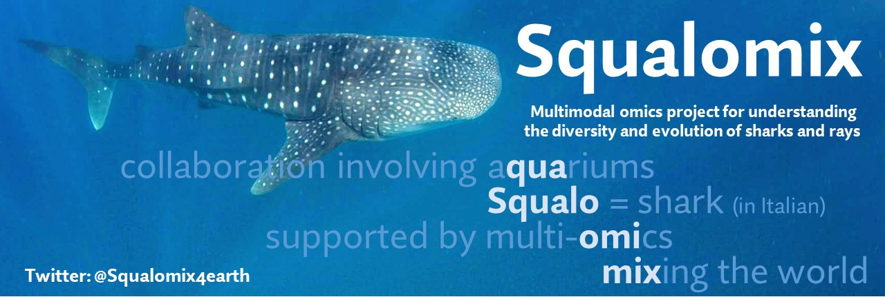

# Squalomix - shark genomics and beyond

## What is 'Squalomix'?
Our project Squalomix aims at unveiling the unique evolutionary trajectory of sharks and rays and is sustained by tight collaborations involving an academic sequencing core facility and multiple public aquariums. By means of multimodal omics and molecular evolutionary approaches, it tackles various biological questions including morphological evolution, sensory systems, and reproduction including sex determination. The project overview is presented in [this introductory movie](https://youtu.be/3VG6t4Bqt8w) prepared for [Biodiversity Genomics 2020 Conference](https://www.sanger.ac.uk/science/biodiversity-genomics-2020/) held online in October 2020. Very importantly, we don't stick to performing de novo sequencing and are rather open to collaborating with other projects for contributing complimentary samples and analyses in order to maximize existing resources. Please find more details in [our position paper](https://doi.org/10.22541/au.162498956.63679523/v1) and a [trailer movie](https://youtu.be/_xXfpIc7l2E) prepared for [Biodiversity Genomics 2021 Conference](https://www.darwintreeoflife.org/news_item/biodiversity-genomics-2021-sequencing-genomes-across-the-planet/) held online in September/October 2021.

For updates, follow us on [Twitter](https://twitter.com/Squalomix4earth).

## Why sharks?
The taxon Elasmobranchii (sharks and rays) is one of the most long-established evolutionary lineages of vertebrates severely underrepresented in molecular-level research. This limitation is attributable to the long-standing absence of their whole genome sequence information, resulting from the elusiveness and low fecundity of those animals, as well as the large and repetitive genomes. Their peculiar body fluid composition has also hindered routine cell culturing that is required for chromosome analysis which serves as an indispensable reference for genome sequencing. 

## Our sequencing products
The resources and products from this project are accessible at or linked from [our original sequence archive](https://transcriptome.riken.jp/squalomix/). We also have an [NCBI BioProject entry](https://www.ncbi.nlm.nih.gov/bioproject/PRJNA707598) that will host reference quality genome assemblies.

## Species
We first chose two egg-laying species, brownbanded bamboo shark (*Chiloscyllium punctatum*) and cloudy catshark (*Scyliorhinus torazame*), to facilitate sustainable sampling without sacrifices of adults as well as to fuel laboratory experimentation. Please see [this post at Nature Research Community](https://natureecoevocommunity.nature.com/posts/39600-decoding-shark-genomes-with-three-species-selected-for-different-reasons) for more details of our species choice. Currently, we are working on >10 more species for transcriptome or/and genome sequencing, and the speices list as of April 2021 is provided below (also, the list as of September 2020 available in the introductory movie linked above). 

Status of sequencing data acquisition 
T, transcriptome reads 
S, illumina short genomic reads 
X, 10x Genomics Chromium linked reads 
N, Oxford nanopore reads 
P, PacBio CLR reads 
H, PacBio HiFi reads 
C, Hi-C reads (or reads with Hi-C derivatives like Omni-C) 
#, Our flagship species 

Last updated on June 22, 2022

| Species |T|S|X|N|P|H|C|
|----|----|----|----|----|----|----|----|
| #Brownbanded bamboo shark  *Chiloscyllium punctatum* | O | O | O | O | O | O | O |
| Whale shark  *Rhincodon typus* | O | O | O | O |   |  | O |
| #Cloudy catshark  *Scyliorhinus torazame*  | O | O | |   | | O | O |
| #Zebra shark  *Stegostoma tigrinum (fasciatum)*  | O | O |  ||   | O | O |
| #Megamouth shark  *Megachasma pelagios*  | O | O | O ||    |  | O |
| Blue shark *Prionace glauca* |  | O | | |  | O | O |
| Short fin mako *Isurus oxyrinchus* |  | O | | |  | O | O |
| Basking shark  *Cetorhinus maximus*  |  | O | O | |   |  |  |
| Coral catshark *Atelomycterus marmoratus*  | O | ||   | | | |
| Sandbar shark *Carcharhinus plumbeus*  | O | | | ||   | |
| Ocellate spot skate *Okamejei kenojei*  | O | | | |  | | |
| #Red stingray *Hemitrygon akajei*  | O | O | | |  | O | O |
| Japanese bullhead shark *Heterodontus japonicus*  | O | | |  | | | |
| Zebra bullhead shark *Heterodontus zebra*  | O | ||   | | | |
| Japanese sleeper ray *Narke japonica*  | O | | | |  | | |
| Frilled shark *Chlamydoselachus anguineus* | O | | |  | | | |
| #Brown guitarfish *Rhinobatos schlegelii*  | O | | ||   | O | O |
| Shark ray *Rhina ancylostoma*  | O | | | |  | | |
| #Slendertail lanternshark *Etmopterus molleri*  | O | | | |  | | |
| Japanese sawshark *Pristiophorus japonicus*  | O | | ||   | | |
| Japanese angelshark *Squatina japonica*  | O | | ||   | O | O |
| Shortspine spurdog *Squalus mitsukurii*  | O | | ||   | | |
| *Rhinoraja longicaudata*  | O | | ||   | O | |

Please note that we don't  list some species for which our collaborators take an initiative in genome sequencing.

## History
The chronological information about our activity before and after the launch of the project is included below. Previously, we reported interim results of our genome analysis on three shark species (brownbanded bamboo shark, cloudy catshark, and whale shark), together with tissue-level gene expression profiles and epigenomic marks of the chromatin regulator CTCF ([Hara et al., 2018. Nat. Ecol. Evol. 2: 1761-1771](https://www.nature.com/articles/s41559-018-0673-5)). Please refer to the introductory paragraphs of this article in 2018 for the information about ealirer genomic studies.

|Year-Month| Event|
|----|----|
|2022 Feb| Project briefing for Japanese researchers and related communities |
|2022 Jan| Squalomix introduced as a part of the [PNAS Special Feature for EBP](https://www.pnas.org/topic/544) |
|2021 Sep| Presentation about our activity at [Virtual Conference Biodiversity Genomics 2021](https://www.darwintreeoflife.org/news_item/biodiversity-genomics-2021-sequencing-genomes-across-the-planet/)  |
|2021 Jun| Release of the [preprint of our position paper at Authorea](https://www.authorea.com/users/386789/articles/528239-squalomix-shark-and-ray-genome-sequencing-to-analyze-their-diversity-and-evolution?commit=242658f3237d97b0b63665b4f2e2b94255b1cdee)|
|2021 May| Our project introduced in [2021 PacBio Japan Virtual User Group Meeting](https://events.pacb.com/Japan-ugm-2021/agenda/session/512638)|
|2021 Apr| Project briefing for (potential) Japanese collaborators working at aquariums |
|2021 Jan| Project briefing for (potential) international collaborators |
|2020 Nov| Squalomix joined [Earth BioGenome Project (EBP)](https://www.earthbiogenome.org/) as an affiliated project|
|2020 Nov| Presentation about our activity at Virtual Annual Conference of Oceania Chondrichthyan Society (OCS) | 
|2020 Oct| Presentation about our activity at [Virtual Conference Biodiversity Genomics 2020](https://www.sanger.ac.uk/science/biodiversity-genomics-2020/) |
|2020 Sep| The project Squalomix officially launched|
|2019 Jul| Presentation about our activity at on-site American Elasmobranch Society (AES) Meeting in Snowbird|
|2019 Jun| Presentation about our activity at on-site 5th International Whale Shark Conference (IWSC) in Exmouth|
|2018 Dec| Presentation about our activity at on-site biennial meeting for Japanese Society of Elasmobranch Studies|
|2018 Oct| Publication of [our first landmark paper](https://www.nature.com/articles/s41559-018-0673-5) for shark genome analysis |

## Our technical basis
For our previous publication in 2018, we produced all short read sequence data in-house at the DNA Analysis Facility operated inside the [Laboratory for Phyloinformatics, RIKEN BDR](https://www.bdr.riken.jp/en/research/labs/kuraku-s/). Our genome assembly also employed mate-pair reads produced with [our protocol guide 'iMate'](https://www.slideshare.net/xsighex/imate-protocol-guide-version-20).

More recently, we released the 'iconHi-C' (inexpensive and controllable Hi-C) protocol for adaptable Hi-C data acquisition ([Kadota et al., 2018. GigaScience 9: giz158](https://doi.org/10.1093/gigascience/giz158)) and performed Hi-C scaffolding to obtain chromosome-scale sequences for shark genomes. The obtained sequences can now be validated with original high-fidelity karyotype data provided by our cell culture protocol for elasmobranchs ([Uno et al., 2020. Commun. Biol. 3: 652](https://www.nature.com/articles/s42003-020-01373-7)). 

