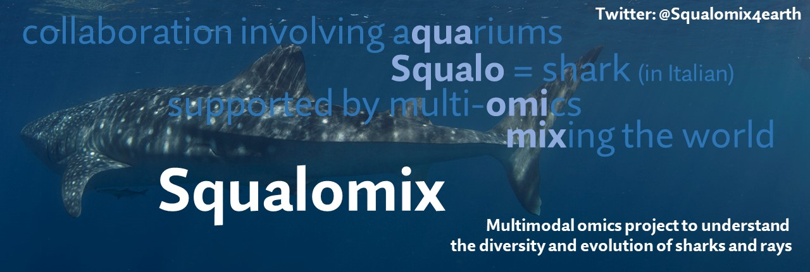

# Squalomix - shark genomics and beyond

## What is 'Squalomix'?
Our project Squalomix aims at unveiling the unique evolutionary trajectory of sharks and rays and is sustained by tight collaborations involving an academic sequencing core facility and multiple public aquariums. By means of multimodal omics and molecular evolutionary approaches, it tackles various biological questions including morphological evolution, sensory systems, and reproduction including sex determination. The project overview is presented in [this introductory movie](https://youtu.be/3VG6t4Bqt8w) prepared for [Biodiversity Genomics 2020 Conference](https://www.sanger.ac.uk/science/biodiversity-genomics-2020/) held online in October 2020. Very importantly, we don't stick to de novo sequencing in person and are rather open to coorditaion with other projects (e.g., VGP, Vertebrate Genome Project) for contributing complimentary samples and analyses in order to maximize existing resources.

## Why sharks? Why not done earlier?
The taxon Elasmobranchii (sharks and rays) is one of the most long-established evolutionary lineages of vertebrates severely underrepredented in molecular-level research. This limitation is attributable to the long-standing absence of their whole genome sequence information, resulting from the elusiveness and low fecundity of those animals, as well as the large and repetitive genomes. Their peculiar body fluid composition has also hindered routine cell culturing that is required for chromosome analysis which serves as an indispensable reference for genome sequencing. 

## Our sequencing products
The resources and products from this project are accessible at or linked from [our original sequence archive](https://transcriptome.riken.jp/squalomix/). 

## Species
We first chose two egg-laying species, brownbanded bamboo shark (*Chiloscyllium punctatum*) and cloudy catshark (*Scyliorhinus torazame*), to facilitate sustainable sampling without sacrifices of adults as well as to fuel laboratory experimentation. Please see [this post at Nature Research Community](https://natureecoevocommunity.nature.com/posts/39600-decoding-shark-genomes-with-three-species-selected-for-different-reasons) for more details of our species choice. Currently, we are working on >10 more species for transcriptome or/and genome sequencing, and the speices list as of September 2020 is provided below and in the introductory movie linked above. 

| Species | Status of genome sequencing (if not stated otherwise) |
----|----|
| Brownbanded bamboo shark  *Chiloscyllium punctatum* | Draft Cpunctatum_v1.0, v2.1, Improvement ongoing |
| Whale shark  *Rhincodon typus* | Draft Rtypus_kobe_v1.0, Improvement ongoing |
| Cloudy catshark  *Scyliorhinus torazame*  | Draft Storazame_v1.0, Improvement ongoing |
| Zebra shark  *Stegostoma fasciatum*  | Ongoing |
| Megamouth shark  *Megachasma pelagios*  | Ongoing |
| Basking shark  *Cetorhinus maximus*  | Ongoing |
| Zebra bullhead shark *Heterodontus zebra*  | Currently only transcriptome |
| Coral catshark *Atelomycterus marmoratus*  | Currently only transcriptome |
| Sandbar shark *Carcharhinus plumbeus*  | Currently only transcriptome |
| Ocellate spot skate *Okamejei kenojei*  | Currently only transcriptome |
| Red stingray *Hemitrygon akajei*  | Currently only transcriptome |
| Japanese bullhead shark *Heterodontus japonicus*  | Currently only transcriptome |
| Japanese sleeper ray *Narke japonica*  | Currently only transcriptome |
| Frilled shark *Chlamydoselachus anguineus*  | Currently only transcriptome |
| Brown guitarfish *Rhinobatos schlegelii*  | Currently only transcriptome |
| Shark ray *Rhina ancylostoma*  | Currently only transcriptome |
| Slendertail lanternshark *Etmopterus molleri*  | Currently only transcriptome |
| Japanese sawshark *Pristiophorus japonicus*  | Currently only transcriptome |
| Japanese angelshark *Squatina japonica*  | Currently only transcriptome |
| Shortspine spurdog *Squalus mitsukurii*  | Currently only transcriptome |

## History
Previously, we reported interim results of our genome analysis on three shark species (brownbanded bamboo shark, cloudy catshark, and whale shark), together with tissue-level gene expression profiles and epigenomic marks of the chromatin regulator CTCF ([Hara et al., 2018. Nat. Ecol. Evol. 2: 1761-1771](https://www.nature.com/articles/s41559-018-0673-5)). Please refer to the introductory paragraphs of this article in 2018 for the information about ealirer genomic studies.

## Our technical basis
For our previous publication in 2018, we produced all short read sequence data in-house at the DNA Analysis Facility operated inside the [Laboratory for Phyloinformatics, RIKEN BDR](https://www.bdr.riken.jp/en/research/labs/kuraku-s/). Our genome assembly also employed mate-pair reads produced with [our protocol guide 'iMate'](https://www.slideshare.net/xsighex/imate-protocol-guide-version-20).

More recently, we released the 'iconHi-C' (inexpensive and controllable Hi-C) protocol for adaptable Hi-C data acquisition ([Kadota et al., 2018. GigaScience 9: giz158](https://doi.org/10.1093/gigascience/giz158)) and performed Hi-C scaffolding to obtain chromosome-scale sequences for shark genomes. The obtained sequences can now be validated with original high-fidelity karyotype data provided by our cell culture protocol for elasmobranchs ([Uno et al., 2020. bioRxiv](https://www.biorxiv.org/content/10.1101/2020.09.08.286724v1)). 

